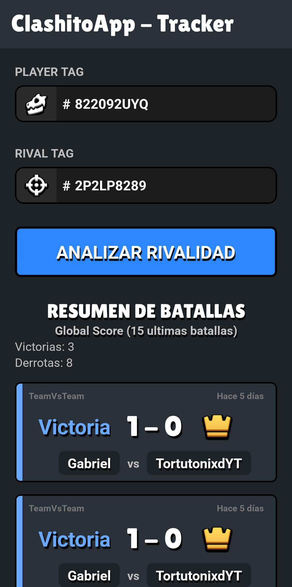

# 👑 ClashitoApp - Tracker


ClashitoApp es una aplicación móvil desarrollada en **React Native / Expo** que te permite rastrear y analizar tu historial de batallas contra rivales específicos en Clash Royale. Diseñada con una interfaz (Dark Theme), fuentes personalizadas y uso de la API oficial de Supercell.

## ✨ Características Principales

- **Búsqueda por Tags:** Ingresa tu Player Tag y el de tu rival para filtrar el historial de enfrentamientos directos.
- **UI/UX Inmersiva:** Diseño oscuro inspirado en la estética de Clash Royale, con componentes personalizados y tipografía temática (Lilita One).
- **Consumo de API Oficial:** Conexión directa y en tiempo real con la API v1 de Supercell.
- **Validación de Datos:** Limpieza automática de inputs para evitar errores en las peticiones HTTP.

## 📱 Pantallas (Screenshots)

|                  Pantalla Principal                  |
| :--------------------------------------------------: |
|  |

## 🛠️ Tecnologías Usadas

- **Framework:** [React Native](https://reactnative.dev/) / [Expo](https://expo.dev/)
- **Lenguaje:** TypeScript / JavaScript
- **Navegación:** Expo Router (File-based routing)
- **Estilos:** StyleSheet nativo con emulación de sombras (Drop Shadow, Text Stroke).
- **Gestión de Entorno:** `.env` nativo de Expo

## 🚀 Requisitos Previos

Para correr este proyecto en tu máquina local, necesitarás:

1. Node.js instalado.
2. Una clave válida de la API de Clash Royale. Puedes obtenerla en el [Portal de Desarrolladores de Supercell](https://developer.clashroyale.com/).

### Variables de Entorno

Crea un archivo llamado `.env` en la raíz del proyecto y agrega tu API Key:

```env
EXPO_PUBLIC_API_KEY=tu_clave_super_secreta_aqui
```
